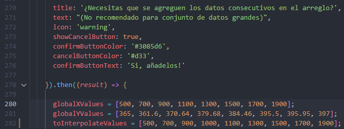

# Frontend para el proyecto final de analisis de tecnicas numericas

- Este repositorio tiene como finalidad mantener un **sgv** para el frontend del proyecto final de analisis de tecnicas numericas 

## Paso a paso para ejecutar

Luego de clonar el repositorio en el dispositivo, para poder ejecutar el servidor local de angular se necesitan seguir los siguientes pasos

1. Instalar node.js en su version lts [aqui un <a href="https://nodejs.org/es/download">enlace</a>]
2. Despues de tener instalado node.js se debe instalar el cliente de angular con el siguiente comando en el cmd <code>npm install -g @angular/cli</code> Nota: (Observar que esta en el local c al momento de correr el comando)
3. Luego de instalar el cliente de angular para instalar las librerias del node_modules necesarias se debe ejecutar el siguiente comando <code>npm install</code> Nota: (Observar que esta en el directorio donde se encuentra el proyecto que se clono al momento de correr el comando)
4. Para finalizar y ejecutar el servidor en local se debe correr el siguiente comando dentro del directorio del proyecto <code>ng serve -o</code>

## Observacion #1
- Para que funcione correctamente el frontend se debe ejecutar con aterioridad el servidor backend en local, el enlace con el repositorio se encuentra <a href="https://github.com/seb4stian69/BackendAnalisis.git">aqui</a>

## Observacion #2
- Los valores para fines de presentacion ya estaban harcodeados, quemados etc.. en el codigo, para evitar que siempre otorgue el mismo resultado se debe eliminar o comentar las siguientes lineas (de la 280 a las 282) esto se encuentra en el archivo **app.component.ts**

